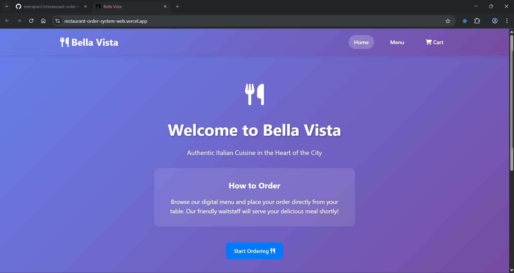
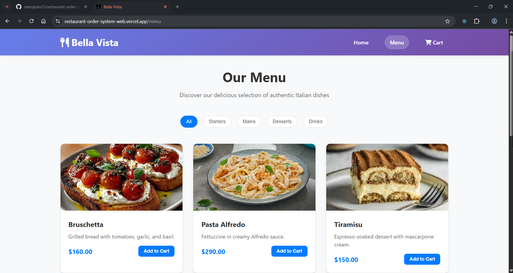
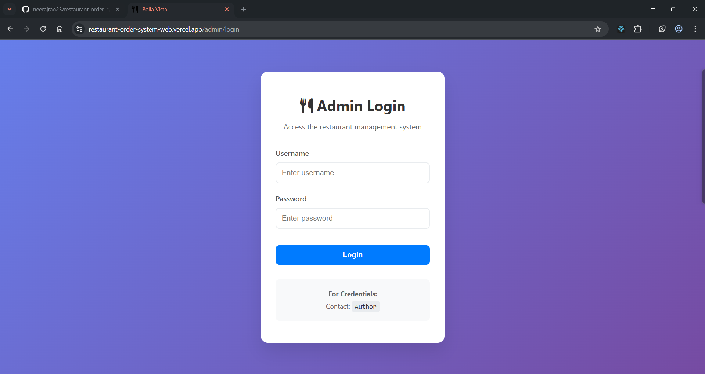
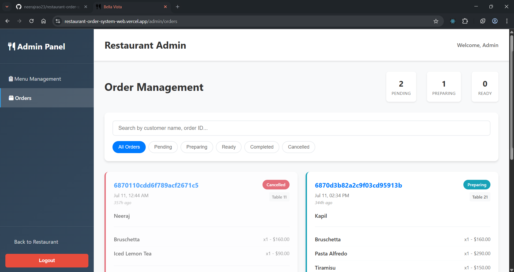

<h1 align="center">🍽️ BellaVista</h1>
<p align="center">An internal restaurant system to browse menu, place orders, and manage them in real time 🔄</p>

<p align="center">
  
  
  
  
  
</p>

---

## ✨ Features

- 🍔 **Customer Menu View** – Browse live menu by category
- 🛒 **Cart & Order** – Add to cart, place orders with real-time status tracking
- 🔐 **Admin Authentication** – Token-based login to secure admin access
- 📋 **Admin Dashboard** – View, update, and manage orders
- ✏️ **Menu Manager** – Add, edit, delete menu items
- 🟢 **Toggle Availability** – Enable/disable items from customer view
- 📦 **REST API** – Clean and modular backend routes

---

## 🧰 Tech Stack

- **Frontend**: React, React Router, Axios, Vite
- **Backend**: Node.js, Express
- **Database**: MongoDB Atlas
- **Authentication**: JWT, Bcrypt
- **Deployment**: Vercel (Frontend) + Render (Backend)

---


## 🌐 Live Demo

🔗 [restaurant-order-system-web.vercel.app](https://restaurant-order-system-web.vercel.app)

🧪 Admin Panel :  
🔗 [restaurant-order-system-web.vercel.app/admin/login](https://restaurant-order-system-web.vercel.app/admin/login)

---

## 📸 Screenshots

### 🧾 Customer View  


---

**Menu**



### 🧑‍🍳 Admin Dashboard  

- can be accessed by protected ``` /admin/login ``` route

**Login**



---

**Menu Management**


---

**Order Management**



---

## 🎥 Watch Demo of Admin

🔗 [Watch Demo Video](./assets/demoAdmin.mp4)

---